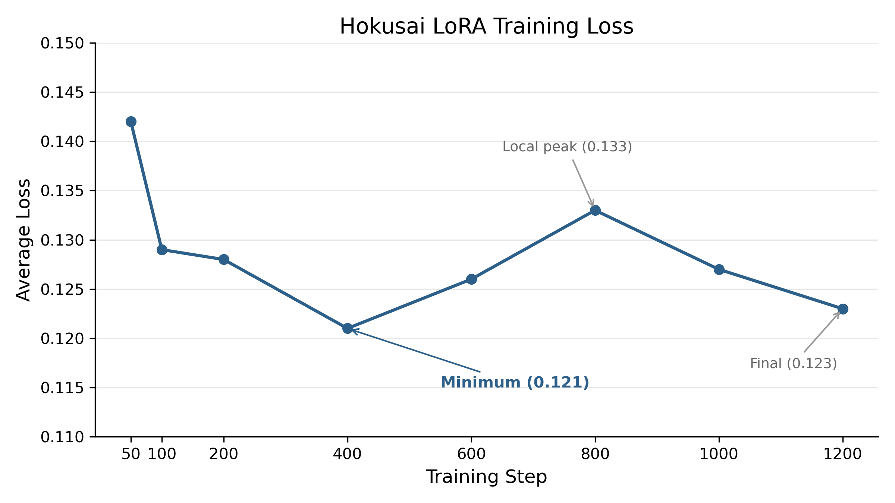
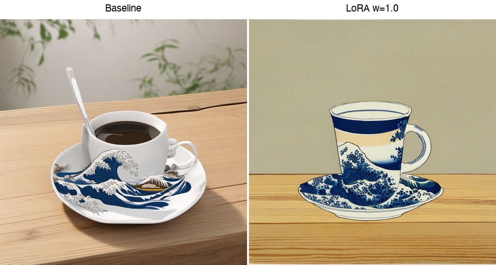
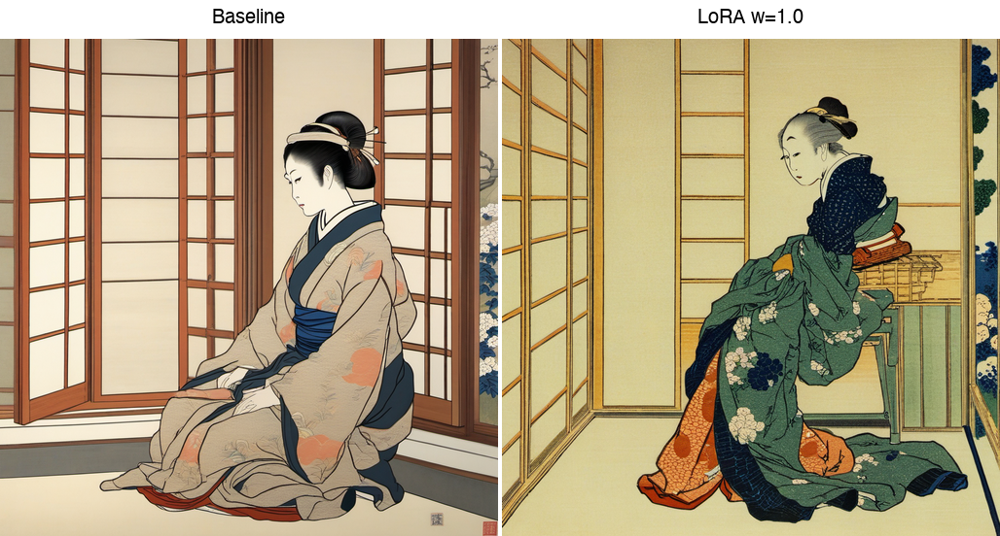
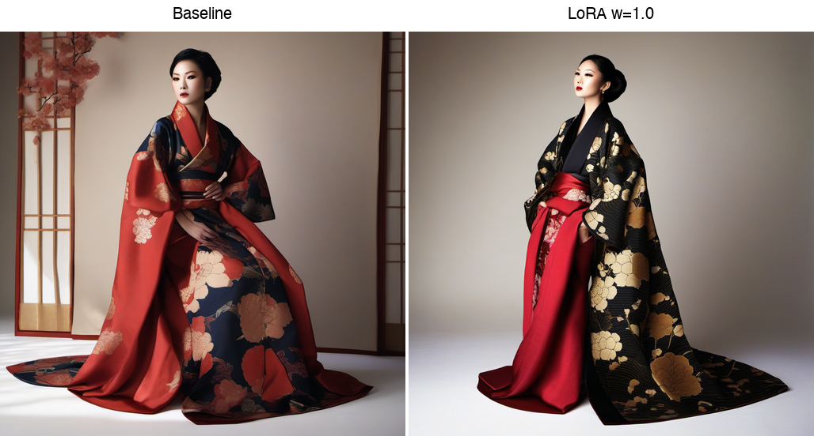
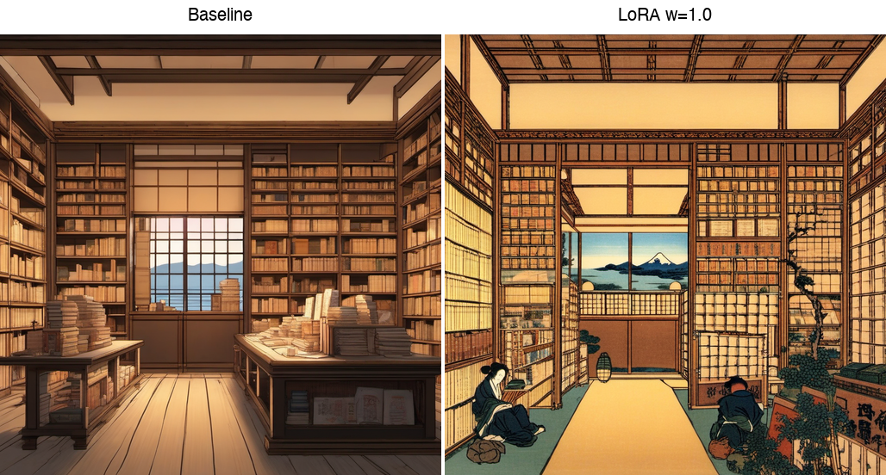
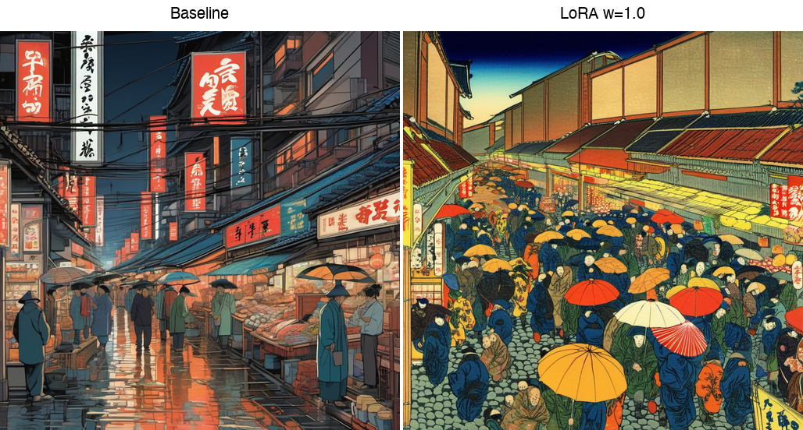
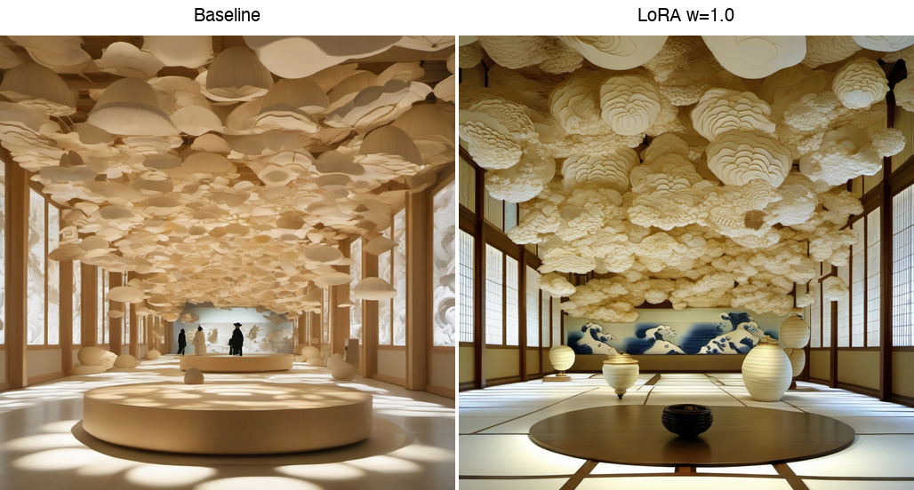
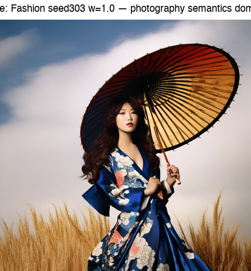
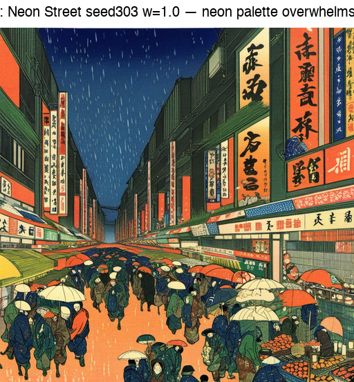
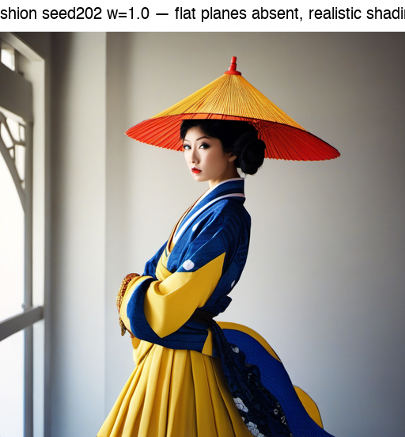

# Challenges of Reproducing Woodblock Print Aesthetics: Training a Hokusai Style LoRA with SDXL — Scenario 3

**Course:** CA6114 Responsible AI Deployment, Nanyang Technological University  
**Date:** April 2026

---

## 1. Research Goal

Can 24 Edo-period woodblock prints teach a text-to-image model to produce bold contour lines, flat color planes, and a constrained indigo-heavy palette?

This question sits at the intersection of computational art history and generative modeling. Ukiyo-e woodblock prints — the dominant visual art form of Japan's Edo period (1603--1868) — embody a set of visual properties that are structurally incompatible with the photorealistic training distribution of modern text-to-image diffusion models. Where photographic imagery relies on continuous tonal gradients, depth-of-field blur, and optically motivated perspective, ukiyo-e prints are defined by bold contour lines that delineate every element of the composition, flat planes of color applied through successive woodblock impressions, a deliberately constrained palette dominated by Prussian blue (indigo) and muted earth tones, and a non-Western approach to spatial composition that organizes depth through overlapping planes rather than linear perspective. These are not merely stylistic preferences; they are physical consequences of the woodblock printing process itself, where each color requires a separate carved block and fine gradients are technically expensive to reproduce.

Stable Diffusion XL (SDXL), the base model used in this experiment, was trained on billions of image-text pairs overwhelmingly sourced from modern digital photography and illustration. Its latent space encodes strong priors toward photorealistic rendering: smooth tonal transitions, optically accurate lighting, and Western single-point perspective. The question, therefore, is not whether SDXL can generate images that superficially resemble ukiyo-e prints — a well-crafted text prompt can approximate the look — but whether a lightweight Low-Rank Adaptation (LoRA) fine-tune on a small, curated dataset of authentic Hokusai prints can fundamentally shift the model's structural output: replacing photographic gradients with flat planes, introducing bold contour lines where the base model would render smooth edges, and constraining the color distribution toward a historically authentic palette.

This report documents the training of a Hokusai-style LoRA on 24 landscape prints and evaluates the resulting model against prompts of varying complexity. The analysis focuses on structural composition — contour clarity, color flatness, and compositional layering — rather than photorealistic fidelity. The central finding is that prompt complexity determines whether the LoRA's print-aesthetic signal survives the generation process: simple prompts yield convincing woodblock-style outputs, while photography-oriented prompts create an explicit conflict between the LoRA's learned print features and SDXL's photorealistic bias, in which photography nearly always wins.

---

## 2. Dataset Curation and Caption Strategy

### 2.1 Source Selection

The training dataset consists of 24 prints by Katsushika Hokusai (1760--1849), sourced from WikiArt's public-domain collection. All 24 images are landscape compositions — rivers, bridges, waterfalls, mountains, lakes, and coastal scenes — drawn primarily from Hokusai's two most celebrated series: *Thirty-six Views of Mount Fuji* (c. 1831) and *A Tour of Waterfalls in Various Provinces* (c. 1833).

The selection was deliberately restricted along three axes. First, only landscape and nature scenes were included; portraits, actor prints (*yakusha-e*), monochrome ink sketches, and flower-and-bird compositions (*kachoga*) were excluded. Second, the dataset is single-artist: every image is by Hokusai, with no works by Hiroshige, Utamaro, or other ukiyo-e masters mixed in. Third, while scenes vary in subject — from the violent dynamism of *The Great Wave of Kanagawa* to the contemplative stillness of *Fuji Reflects in Lake Kawaguchi* — all share the formal properties of Hokusai's mature woodblock style: bold outlines, flat color application, and compositions organized around a dominant landscape feature (typically Mount Fuji or a body of water).

The rationale for these constraints is to maximize style consistency while varying scene content. If the model were trained on a heterogeneous mix of ukiyo-e sub-genres — portraits alongside landscapes, sketches alongside fully colored prints — the LoRA would need to disentangle multiple style signals simultaneously, increasing the risk that it learns none of them well. By holding the medium (full-color woodblock print), the artist (Hokusai), and the genre (landscape) constant, the only variable across training images is the specific scene depicted. This design encourages the LoRA to associate its trigger token with the shared formal properties — the style — rather than with any particular scene content.

The dataset size of 24 images was a deliberate constraint rather than a limitation of available material. Hokusai's WikiArt catalogue contains hundreds of works, but expanding the dataset would require either including non-landscape genres (diluting style coherence) or mixing in works from other ukiyo-e artists (introducing artist-specific variation). Twenty-four landscape prints provide sufficient variety in scene composition — waterfalls, bridges, open water, mountain ridges, urban streetscapes — while maintaining the tight stylistic envelope needed for a low-rank adaptation.

### 2.2 Caption Design as Methodological Contribution

Each training image was captioned using a structured template with two components: a fixed style spine and a variable scene description. Three representative captions illustrate the pattern:

> `<hokusai_style>, ukiyo-e woodblock print, towering wave over small boats with mountain in the distance, flat color planes, indigo-heavy palette, bold contour lines, Edo-period Japanese print composition`

> `<hokusai_style>, ukiyo-e woodblock print, large bridge framing mount fuji in the distance, flat color planes, indigo-heavy palette, bold contour lines, Edo-period Japanese print composition`

> `<hokusai_style>, ukiyo-e woodblock print, tall waterfall dropping beside steep rocks and trees, flat color planes, indigo-heavy palette, bold contour lines, Edo-period Japanese print composition`

The fixed style spine — "ukiyo-e woodblock print" + "flat color planes" + "indigo-heavy palette" + "bold contour lines" + "Edo-period Japanese print composition" — appears identically in every caption. This repetition is intentional: it teaches the text encoder to bind the trigger token `<hokusai_style>` to a specific cluster of visual-feature descriptors. The variable component — the scene-specific subject description — changes for each image, describing what the print depicts ("towering wave over small boats", "large bridge framing mount fuji", "fisherman on a steep riverbank above deep blue water").

This two-component structure serves a specific pedagogical function for the model. By holding the style descriptors constant while varying the content descriptors, the caption design creates an implicit factorization: the model learns to associate `<hokusai_style>` with *consistent style features* (contour lines, flat color, indigo palette, print composition) while recognizing that *content features* (waves, bridges, waterfalls) are independent of the trigger token. This reduces content overfitting — the tendency of small-dataset LoRAs to memorize specific training images rather than learning transferable style features.

Consider the alternative: a hypothetical uniform template approach where all 24 images share an identical caption such as "`<hokusai_style>, ukiyo-e woodblock print`". Under this scheme, the model receives no signal about which aspects of the image are style-related (and thus should be associated with the trigger token) and which are content-related (and thus should vary). The result is a LoRA that tends to reproduce specific Hokusai compositions — generating wave-like forms or Mount Fuji regardless of the prompt — rather than transferring the abstract style properties to novel subjects. The structured caption approach mitigates this risk by explicitly labeling style and content in the training signal.

---

## 3. Training Setup and Evidence

### 3.1 Training Configuration

| Parameter | Value |
|-----------|-------|
| Base Model | Stable Diffusion XL 1.0 |
| Trigger Token | `<hokusai_style>` |
| LoRA Rank / Alpha | 16 / 16 |
| UNet Learning Rate | 1e-4 |
| Text Encoder LR | 5e-5 |
| LR Scheduler | Cosine with 5% warmup |
| Dataset | 24 images x 10 repeats = 240 samples/epoch |
| Total Steps | 1200 (= 5 epochs) |
| Batch Size | 1 |
| Precision | bf16 |
| Hardware | NVIDIA A800 GPU |
| Training Time | 21 minutes 19 seconds |

The training pipeline used sd-scripts with the DreamBooth method, running on a single NVIDIA A800 GPU. After training, inference was conducted through **ComfyUI**, a node-based visual workflow tool. The key advantage of ComfyUI for this experiment was its **LoraLoader** node, which exposes two independent weight sliders: `strength_model` (controlling the LoRA's influence on the UNet image-generation pathway) and `strength_clip` (controlling its influence on the text-encoding pathway). Both were set to the same value for each validation run (0.0 for baseline, 0.6, 0.8, or 1.0), but the dual-slider design made it easy to experiment with asymmetric configurations during initial testing — for example, keeping the text-encoder weight low while increasing the model weight, which affects visual style without strongly shifting semantic interpretation. The generation parameters were configured through ComfyUI's **KSampler** node: Euler sampler, 30 denoising steps, CFG scale 7, at 1024×1024 resolution. These settings were selected after manual experimentation in ComfyUI's visual interface, balancing generation quality against the 72-image evaluation workload.

### 3.2 Loss Curve Analysis



The training loss trajectory reveals a characteristic pattern that merits careful interpretation. The table below summarizes average loss values at key checkpoints throughout the 1200-step training run:

| Step | Average Loss |
|------|-------------|
| 50 | 0.142 |
| 100 | 0.129 |
| 200 | 0.128 |
| 400 | 0.121 (checkpoint minimum) |
| 600 | 0.126 |
| 800 | 0.133 (local peak) |
| 1000 | 0.127 |
| 1200 | 0.123 (final) |

The loss curve exhibits three distinct phases. In the first phase (steps 0--400), the model undergoes rapid descent from 0.142 at step 50 to 0.121 at step 400 (the lowest value among checkpoint milestones), a relative reduction of approximately 15%. Finer-grained inspection of the per-step log reveals that the actual global minimum occurs around step 520 at approximately 0.117, before the loss begins to oscillate. This initial phase corresponds to the LoRA weights learning the coarse statistical signatures of the training distribution: the dominant indigo color channel, the high-contrast edges characteristic of woodblock contour lines, and the reduced tonal variance within flat color regions. The cosine learning rate schedule with 5% warmup (approximately 60 steps) means that the full learning rate is reached by step 60, after which the model aggressively fits the training signal.

In the second phase (steps 400--800), the loss ceases to decrease monotonically and instead oscillates between 0.121 and 0.133. This oscillation is significant. Rather than the steady increase that would indicate overfitting (where the model memorizes individual training images at the expense of generalization), the loss fluctuates around a plateau. The local peak at step 800 (0.133) is particularly notable — it represents a moment where the model temporarily loses some of the style-specific features it had captured at step 400, likely because the declining learning rate under the cosine schedule is no longer strong enough to maintain all the LoRA weight adjustments simultaneously. The model cycles between memorizing specific training images and generalizing the shared style features across the 24-image dataset.

In the third phase (steps 800--1200), the loss recovers from the step-800 peak and settles at 0.123 by the final step. This recovery suggests that the late stages of training consolidate the style features without catastrophic forgetting — the LoRA weights converge to a stable configuration that captures the essential woodblock print properties.

### 3.3 Checkpoint Selection

The per-step global minimum occurs around step 520 (loss ≈ 0.117), while the checkpoint-milestone minimum is step 400 (0.121). However, the final checkpoint at step 1200 (loss 0.123) was selected for all validation experiments. The rationale is twofold. First, the difference between the global minimum and the final checkpoint is small — a gap of 0.006 in average loss — and training loss alone is not a reliable predictor of generation quality for style transfer tasks where the objective is aesthetic rather than reconstructive. Second, the final checkpoint benefits from cumulative exposure to five complete passes over the training distribution, which provides more opportunities for the model to encounter every training image in diverse mini-batch orderings. While an earlier checkpoint may have slightly lower training loss, the step-1200 checkpoint is expected to exhibit better generalization to novel prompts — which is precisely what this experiment evaluates. A rigorous comparison between multiple checkpoints would require systematic visual evaluation across all test prompts, which remains a direction for future investigation.

### 3.4 Reproducibility and Evidence Trail (Automation)

The 72-image validation matrix is produced through an automated pipeline that separates **experimental specification** (prompts/seeds/weights) from **execution** (ComfyUI batch inference):

1. **Specification (source of truth):** `infra/templates/validation_prompts.yaml` defines the 3 tiers, 6 prompts, 3 seeds, 4 LoRA weight settings, and a global negative prompt.
2. **Manifest rendering:** `infra/bin/render_validation_manifest.py` expands the YAML into `runtime/workspace/report_assets/validation_manifest.csv` (one row per tier × prompt × seed × weight).
3. **Batch execution via ComfyUI API:** `infra/bin/run_comfyui_batch.py` injects each CSV row into a fixed workflow template (`infra/workflows/sdxl_style_lora_inference.json`), queues the prompt on ComfyUI, and writes `runtime/workspace/report_assets/validation_execution.csv` with prompt IDs and generated output file paths.

**Output naming rule.** Each image is saved with a deterministic prefix:

`validation/{workspace_name}/{tier}/r{row_index}_{weight_tag}_seed{seed}_{prompt_tag}`

where `weight_tag` is `baseline` or `w0p6/w0p8/w1p0`, and `prompt_tag` is a sanitized, lowercased prompt substring (non-alphanumeric → `_`, truncated). This rule enables appendix figures to reference exact outputs without manual renaming.

### 3.5 Supplementary Ablation: Asymmetric LoRA Weights (UNet vs. Text Encoder)

A key diagnostic for ukiyo-e transfer is separating **structural rendering changes** (contours, flat planes) from **semantic drift** (Japanese cultural signifiers, kimono, etc.). ComfyUI exposes two LoRA sliders:

- `strength_model`: modifies the UNet pathway (expected to affect contour/flatness/texture)
- `strength_clip`: modifies the text-encoder pathway (expected to affect prompt interpretation and semantic associations)

The main matrix uses symmetric weights for comparability. A focused asymmetric ablation on a fixed prompt/seed (e.g., the fashion editorial prompt, seed 101) can compare:

- **(1.0, 1.0)**: maximum symmetric influence
- **(1.0, 0.2)**: keep structural injection while reducing semantic drift
- **(0.8, 0.0)**: UNet-only, testing whether contour/flatness can be preserved under photography-oriented prompts

This ablation is intentionally small because expanding it across all 72 settings would multiply the evaluation grid.

---

## 4. Results by Prompt Complexity

The trained LoRA was evaluated across six prompts spanning three complexity tiers — simple, medium, and complex — at LoRA weights of 0.0 (baseline), 0.6, 0.8, and 1.0, with three random seeds (101, 202, 303) per configuration, yielding 72 total generated images. The analysis below focuses on the LoRA weight of 1.0, where the style signal is strongest and the tension between print aesthetics and photographic bias is most visible.

The evaluation uses three structural metrics derived from the formal properties of ukiyo-e prints, rather than photorealistic quality metrics:

- **Contour Clarity:** The presence and sharpness of bold outlines separating distinct compositional elements, analogous to the carved lines of a woodblock.
- **Color Flatness:** The degree to which color regions appear as uniform planes rather than smooth gradients, reflecting the ink-application method of woodblock printing.
- **Compositional Layering:** The organization of the image into distinct foreground, middle-ground, and background planes, characteristic of Hokusai's approach to spatial depth.

| Prompt | Tier | Best Weight | Contour Clarity | Color Flatness | Compositional Layering | Main Observation |
|--------|------|-------------|----------------|---------------|----------------------|-----------------|
| Coffee cup on table | Simple | 1.0 | High | High | Medium | Strong ukiyo-e character; cup surface shows wave patterns; flat background |
| Fashion editorial | Medium | 1.0 | Low | Low | Low | Photography semantics dominate; LoRA shifts content (kimono) but not structure |
| Neon street market | Complex | 1.0 | Medium-High | Medium | High | Surprisingly effective; "layered depth" aligns with ukiyo-e composition naturally |

To interpret failures in a way that is actionable (and aligned with the print-aesthetics goal), the following taxonomy links prompt conditions to failure modes and concrete mitigations.

| Failure Type | Typical Trigger | Observable Symptom | Mitigation (Actionable) |
|---|---|---|---|
| Photography-anchor override | Prompt contains camera/lighting jargon (“rim light”, “85mm lens”, studio realism) | Smooth gradients persist; no flat planes; contour lines suppressed | Rewrite prompts using print-compatible vocabulary (“bold outlines”, “flat color planes”, “layered planes”); reduce CFG; reduce `strength_clip` while keeping `strength_model` higher |
| Palette leakage (modern neon) | Prompt demands high-saturation lighting (“neon”, “HDR”, reflective wet surfaces) | Composition becomes print-like but colors stay modern | Add explicit palette constraints (“indigo-heavy”, “muted earth tones”); post-process palette remapping; use a palette-conditioned auxiliary control (future work) |
| Semantic drift from trigger token | Trigger token biases base model even at LoRA weight 0 | Baseline already contains Japanese content signifiers | Add a strict control condition without the trigger token to separate token semantics from LoRA-weight effects; use asymmetric weights to reduce text-side drift |

### 4.1 Simple Prompt: Coffee Cup on a Wooden Table (Seed 303)

**Prompt:** `"<hokusai_style>, a coffee cup on a wooden table, clean composition"`

This prompt was designed as a minimal-complexity baseline: a single object, a simple setting, and no photography-specific vocabulary. The only directives beyond the trigger token are the subject ("coffee cup on a wooden table") and a compositional instruction ("clean composition") that is stylistically neutral.

The results demonstrate that when prompt complexity is low, the trigger token exerts strong control over the output's structural properties. At LoRA weight 1.0, the generated image (see Appendix, Fig. B1) transforms from a standard photographic still-life into something resembling a woodblock print illustration. The coffee cup itself acquires bold, dark contour lines that define its silhouette against the background — lines that are entirely absent in the baseline image. The cup's surface displays decorative wave-like patterns reminiscent of the undulating water motifs found throughout Hokusai's landscape prints, a clear sign that the LoRA is projecting learned texture patterns onto novel objects. The background simplifies dramatically: where the baseline shows subtle photographic gradients and ambient occlusion shadows, the LoRA output flattens the background into a uniform, muted tone that reads as a single ink impression rather than a lit environment.

The saucer beneath the cup is particularly telling. In the baseline, it catches highlights and casts a soft shadow typical of product photography. At w=1.0, the saucer displays wave-like decorative patterns and sits on a flattened surface with minimal tonal variation. This demonstrates that the LoRA is not merely applying a color filter — it is restructuring how the model renders surfaces, replacing photographic material simulation (specular highlights, subsurface scattering) with graphic, pattern-based rendering.

The "clean composition" instruction in the prompt actually assists the LoRA's effect. Ukiyo-e prints characteristically employ generous negative space and uncluttered arrangements, so the prompt's compositional directive aligns with — rather than conflicts with — the training distribution. This alignment is a key factor in the strong style transfer observed at the simple tier.

### 4.2 Medium Prompt: Fashion Editorial Portrait (Seed 101)

**Prompt:** `"<hokusai_style>, a fashion editorial portrait, dramatic rim light, 85mm lens, rich color contrast"`

This is the most revealing prompt in the evaluation battery, and the one that most clearly exposes the fundamental tension between print aesthetics and photographic semantics. The prompt combines the Hokusai trigger token with vocabulary drawn directly from commercial photography: "dramatic rim light" (a specific studio lighting technique), "85mm lens" (a focal length associated with portrait photography's shallow depth of field), and "rich color contrast" (a directive that implies the saturated, high-dynamic-range look of modern digital photography).

The baseline image — generated without the LoRA — already shows an unexpected influence from the trigger token. Even though the LoRA weights are set to zero, the text `<hokusai_style>` in the prompt nudges the base model toward Japanese aesthetic associations. The baseline figure (see Appendix, Fig. B3, left panel) features a woman wearing an elaborate kimono, suggesting that the trigger token's presence in the text embedding space is sufficient to shift SDXL's content generation toward Japanese cultural signifiers, even before the LoRA weights are applied. This is a noteworthy observation: the trigger token functions as both a LoRA activation signal and a semantic content modifier.

At LoRA weight 1.0 (see Appendix, Fig. B3, right panel), the kimono becomes more elaborate, with gold-and-black patterns that evoke traditional Japanese textile designs. However, the overall rendering remains fundamentally photographic. Smooth skin gradients persist — the model renders the face with the continuous tonal transitions characteristic of studio portrait photography, not the flat color planes of a woodblock print. Realistic fabric folds appear in the kimono, complete with soft shadows that imply volumetric three-dimensional form. Studio-style rim lighting creates bright edge highlights along the figure's contour, exactly as the prompt requested. In short, the prompt's photographic vocabulary — "dramatic rim light", "85mm lens", "rich color contrast" — overrides the LoRA's flat-plane tendency.

This result reveals a hierarchy of influence in SDXL's generation process. When a prompt's semantic content explicitly invokes photographic rendering techniques, those semantics take precedence over the LoRA's structural modifications. The LoRA successfully shifts the *content* (a generic fashion model becomes a kimono-wearing figure in a Japanese-inspired setting) but fails to shift the *structure* (the image remains photographic in its use of gradients, lighting, and depth of field). The photography-oriented prompt vocabulary acts as an anchor that holds the model in its photorealistic operating regime, and the LoRA's rank-16 modification is insufficiently powerful to overcome that anchor.

This finding is further corroborated by examining the fashion editorial prompt across multiple seeds. At seed 303 (see Appendix, Fig. B7), photography semantics dominate even more strongly, producing what appears to be a conventional studio fashion photograph with only subtle Japanese content influences. At seed 202 (see Appendix, Fig. B9), flat color planes remain entirely absent, and realistic shading persists throughout the figure and background. The consistency of this failure across seeds confirms that it is a systematic effect of prompt-style conflict rather than a random artifact of particular noise initializations.

### 4.3 Complex Prompt: Rainy Neon Street Market at Night (Seed 202)

**Prompt:** `"<hokusai_style>, a rainy neon street market at night, layered depth, reflective surfaces, crowded scene"`

This prompt was expected to be the most challenging for style transfer: it describes a modern urban scene (neon lights, street market, nighttime rain) that has no historical counterpart in Hokusai's 19th-century landscape prints. The hypothesis was that the extreme semantic distance between the prompt's content and the training distribution would cause the LoRA to fail entirely, producing either a standard photographic neon-street image or an incoherent hybrid.

The actual result is more nuanced and more interesting than expected. At LoRA weight 1.0 (see Appendix, Fig. B5), the neon street market undergoes a substantial transformation that successfully captures several key ukiyo-e structural properties. The scene's spatial organization shifts from photographic depth-of-field rendering to a layered-plane composition: figures in the foreground, shop facades in the middle ground, and a distant background are separated into visually distinct planes, echoing Hokusai's characteristic foreground-middleground-background layering in prints like *Mitsui Shop on Suruga Street in Edo*. Shop facades flatten into panel-like surfaces reminiscent of the architectural elements in Hokusai's urban scenes. The crowd of figures, rather than exhibiting the three-dimensional volume of photographic subjects, takes on a flattened, graphic quality with visible contour lines separating individual figures from their surroundings.

The key insight is that the prompt's instruction for "layered depth" accidentally aligns with a fundamental principle of ukiyo-e composition. Hokusai organized spatial depth through overlapping planes rather than continuous perspective recession — a technique sometimes called "stacking" in art-historical literature. When the prompt explicitly requests "layered depth", it provides the model with a compositional directive that the LoRA can fulfill using its learned ukiyo-e spatial logic, rather than fighting against it. This fortuitous alignment between prompt vocabulary and training-distribution composition explains why the complex neon-street prompt achieves stronger style transfer than the medium fashion-editorial prompt, despite being more semantically distant from the training data.

However, the transformation is not complete. The neon color palette — saturated pinks, electric blues, bright yellows — is far more vibrant than any palette found in authentic woodblock prints, where the available pigments limited the range to indigo, ochre, vermillion, and a few vegetable-derived hues. While the composition achieves a convincing ukiyo-e structure, the color distribution remains anchored in the modern neon-light vocabulary of the prompt. At seed 303 (see Appendix, Fig. B8), this color-palette conflict is even more pronounced: the neon palette overwhelms the LoRA's indigo tendency entirely, producing an image that is structurally print-like but chromatically modern.

This split outcome — structural success combined with chromatic failure — suggests that the LoRA's learned features are not equally strong across all visual dimensions. The compositional and contour-line features appear more robustly encoded than the color-palette constraint, possibly because contour lines and flat planes are spatially localized features that the UNet's convolutional layers can learn from a small dataset, while color palette is a global statistical property that requires more training data to override SDXL's strong priors.

### 4.4 Reframing the Evaluation Criterion

A critical interpretive point emerges from these results: the LoRA does not enhance photographic realism — it reduces photographic feel and increases graphic, print-like quality. This reframing is essential for evaluating the experiment's success. If one were to assess these images using standard image-quality metrics designed for photographic fidelity (FID against a photographic reference set, sharpness, tonal range), the LoRA outputs would score poorly. But such metrics are inappropriate for evaluating style transfer toward a non-photographic target. What appears as "degraded quality" in a photo-realism evaluation — reduced tonal gradients, visible contour lines, simplified color regions — is actually evidence of successful style transfer when evaluated through a print-aesthetics lens. The evaluation framework must match the creative intent.

---

## 5. Discussion — Style Abstraction versus Photographic Realism

The results of this experiment illuminate a broader tension in LoRA-based style transfer: the conflict between two fundamentally different visual paradigms. On one side is the Western photographic tradition, which dominates SDXL's training distribution and encodes assumptions about continuous tonal gradients, optically motivated perspective, and physically based light transport. On the other side is the East Asian woodblock-print tradition, which prioritizes graphic clarity, flat color application, bold contour lines, and compositional layering achieved through overlapping planes rather than vanishing-point perspective.

The LoRA's value, when properly understood, is not "making things look real" but "making things look designed and graphic." It shifts SDXL's output away from simulation (attempting to replicate what a camera would capture) and toward construction (creating an image according to aesthetic rules that are independent of optical physics). This is a meaningful distinction. A woodblock print is not a degraded photograph; it is a fundamentally different representational system with its own internal logic of space, color, and line. The LoRA, to the extent that it succeeds, teaches SDXL a fragment of this alternative logic.

The prompt-complexity gradient observed in the results maps directly onto this paradigm conflict. When prompts are compositionally simple and use stylistically neutral vocabulary ("a coffee cup on a wooden table, clean composition"), they do not anchor the model in the photographic regime. The LoRA operates in a relatively uncontested latent space and can express its learned print features freely. When prompts introduce photography-specific vocabulary ("dramatic rim light", "85mm lens", "reflective surfaces"), they activate SDXL's photographic priors with explicit force, creating a contested latent space where the LoRA's rank-16 modification must compete against the base model's deeply encoded rendering assumptions. The LoRA's influence is real but insufficient to overcome these priors when they are directly invoked.

This asymmetry has practical implications for anyone attempting to use LoRA-based style transfer to reproduce non-photographic visual traditions. The effectiveness of the LoRA is not a fixed property of the trained weights — it is a function of the interaction between those weights and the inference-time prompt. A LoRA that appears highly effective with one class of prompts may appear ineffective with another, not because the weights have changed, but because the prompt has shifted the battleground to a region of latent space where the base model's priors are stronger.

The most surprising result — that the complex neon-street prompt achieves stronger structural style transfer than the medium fashion-editorial prompt — reinforces this analysis. Semantic distance from the training data is less important than vocabulary alignment with the target aesthetic. A prompt can describe a scene that Hokusai never encountered (a neon street market) and still achieve strong style transfer, so long as its compositional vocabulary ("layered depth", "crowded scene") is compatible with ukiyo-e spatial logic. Conversely, a prompt can describe a scene that is stylistically proximate to ukiyo-e subject matter (a Japanese-inflected fashion portrait) and still fail at style transfer if its technical vocabulary ("rim light", "85mm lens") anchors the model in a conflicting rendering paradigm.

This finding suggests that LoRA-based style transfer is most effective when the target style and the prompt vocabulary share compatible visual assumptions. Practitioners aiming to generate woodblock-print-style imagery should not merely prepend a trigger token to a standard photography prompt. Instead, they should rephrase their prompts in vocabulary that is compatible with the target style's compositional logic — using terms like "layered planes", "bold outlines", and "flat color" rather than "rim light", "bokeh", and "lens flare."

---

## 6. Future Work

Several directions emerge from this experiment, each targeting a specific limitation observed in the results.

**ControlNet Composition Guidance.** The LoRA alone cannot guarantee the presence of bold contour lines in every generated image — as demonstrated by the fashion-editorial results, photographic prompt vocabulary can suppress the contour-line feature entirely. Combining the LoRA with a ControlNet conditioned on edge-detection maps (e.g., Canny or HED edges) would provide an additional structural constraint that enforces contour lines regardless of prompt content. This two-adapter approach — LoRA for style, ControlNet for structure — could decouple the style signal from its vulnerability to prompt-semantic interference, ensuring that the defining linear quality of woodblock prints persists even when the prompt demands photographic lighting or depth of field.

**Style and Content Disentanglement.** The current LoRA encodes style and content features in a single set of rank-16 weight modifications. A more principled approach would train separate LoRA modules for composition (spatial layering, contour lines) and color (indigo-heavy palette, flat color planes), enabling independent control at inference time. Such disentanglement could be achieved through multi-objective training with explicit loss terms for edge density (rewarding contour lines) and color-histogram similarity (rewarding palette fidelity), or through architectural modifications that route compositional and chromatic features through separate LoRA branches.

**Palette-Constrained Generation.** The neon-street results demonstrate that the LoRA's influence on color palette is weaker than its influence on composition and contour lines. A dedicated palette-constraint mechanism — either through post-processing (remapping generated colors to a traditional ukiyo-e color histogram) or through inference-time conditioning (using a color-palette ControlNet or classifier-free guidance toward a reference palette) — would address the chromatic leakage observed when prompts describe modern, high-saturation environments. Historical ukiyo-e palettes are well documented; translating those palettes into a conditioning signal is a tractable engineering challenge.

**Image-to-Image Workflow.** Rather than relying on text-to-image generation from noise, an image-to-image pipeline could use existing sketches, line drawings, or edge maps as input, combined with the Hokusai LoRA, to produce outputs with guaranteed structural integrity. This approach leverages the strength of the LoRA (color and texture transformation) while outsourcing its weakness (structural consistency) to the input image. Artists could sketch a composition in the ukiyo-e layered-plane style and then use the LoRA to fill in Hokusai-specific color and texture, achieving a degree of control that pure text-to-image generation cannot provide.

**Broader Evaluation Metrics.** This report relied on qualitative, human-assessed metrics (contour clarity, color flatness, compositional layering) because no standardized quantitative metric for "woodblock-print-ness" exists. Developing such a metric — based on measurable image properties like edge density (the proportion of pixels detected as edges by a Canny filter), color-histogram flatness (the entropy of the color distribution within segmented regions), and gradient-magnitude distribution (distinguishing flat planes from smooth gradients) — would enable objective comparison across LoRA configurations, checkpoint selections, and prompting strategies. Such a metric would also facilitate automated hyperparameter search, replacing the current manual evaluation process.

**ComfyUI Tooling Gaps.** While ComfyUI's node-based interface provides intuitive control over individual generation parameters, it currently lacks built-in support for systematic side-by-side comparison of multiple outputs. Evaluating 72 images across different LoRA weights and prompts required manually navigating the output directory and visually comparing results externally. A native comparison view — allowing users to display baseline and LoRA-applied results side by side within the ComfyUI interface, or to arrange outputs in a grid by seed and weight — would significantly improve the evaluation workflow. Additionally, ComfyUI does not currently offer any built-in style evaluation metrics; integrating lightweight image-analysis nodes (e.g., edge-density calculation, color-histogram comparison against a reference palette) directly into the workflow graph would allow users to receive quantitative feedback alongside visual output, closing the gap between generation and evaluation.

---

## Appendix

### A. Generated Image Comparisons

All images below were generated using SDXL 1.0 with the Hokusai LoRA at the specified weight. Each comparison shows the baseline (no LoRA) on the left and the LoRA-applied output on the right, using identical seeds and prompts.

**Fig. B1:** Simple — Coffee Cup (seed 303): Baseline vs LoRA w=1.0  
Prompt: `"<hokusai_style>, a coffee cup on a wooden table, clean composition"`



---

**Fig. B2:** Simple — Portrait (seed 101): Baseline vs LoRA w=1.0  
Prompt: `"<hokusai_style>, a portrait of a woman near a window, soft natural light"`



---

**Fig. B3:** Medium — Fashion Editorial (seed 101): Baseline vs LoRA w=1.0  
Prompt: `"<hokusai_style>, a fashion editorial portrait, dramatic rim light, 85mm lens, rich color contrast"`



---

**Fig. B4:** Medium — Bookstore (seed 202): Baseline vs LoRA w=1.0  
Prompt: `"<hokusai_style>, a bookstore interior, warm ambient lighting, cinematic framing"`



---

**Fig. B5:** Complex — Neon Street (seed 202): Baseline vs LoRA w=1.0  
Prompt: `"<hokusai_style>, a rainy neon street market at night, layered depth, reflective surfaces, crowded scene"`



---

**Fig. B6:** Complex — Museum Hall (seed 101): Baseline vs LoRA w=1.0  
Prompt: `"<hokusai_style>, a surreal museum hall with floating sculptures, volumetric light, wide establishing shot"`



---

**Fig. B7:** Failure Case — Fashion (seed 303, w=1.0): Photography semantics dominate  
Prompt: `"<hokusai_style>, a fashion editorial portrait, dramatic rim light, 85mm lens, rich color contrast"`



---

**Fig. B8:** Failure Case — Neon Street (seed 303, w=1.0): Neon palette overwhelms indigo  
Prompt: `"<hokusai_style>, a rainy neon street market at night, layered depth, reflective surfaces, crowded scene"`



---

**Fig. B9:** Failure Case — Fashion (seed 202, w=1.0): Flat planes absent, realistic shading persists  
Prompt: `"<hokusai_style>, a fashion editorial portrait, dramatic rim light, 85mm lens, rich color contrast"`



---

### B. Training Configuration

| Parameter | Value |
|-----------|-------|
| Base Model | Stable Diffusion XL 1.0 |
| Trigger Token | `<hokusai_style>` |
| LoRA Rank / Alpha | 16 / 16 |
| UNet Learning Rate | 1e-4 |
| Text Encoder LR | 5e-5 |
| LR Scheduler | Cosine with 5% warmup |
| Dataset | 24 images x 10 repeats = 240 samples/epoch |
| Total Steps | 1200 (= 5 epochs) |
| Batch Size | 1 |
| Precision | bf16 |
| Hardware | NVIDIA A800 GPU |
| Training Time | 21 minutes 19 seconds |

### C. Loss Curve Data

| Step | Average Loss |
|------|-------------|
| 50 | 0.142 |
| 100 | 0.129 |
| 200 | 0.128 |
| 400 | 0.121 |
| 600 | 0.126 |
| 800 | 0.133 |
| 1000 | 0.127 |
| 1200 | 0.123 |

### D. Training Log Excerpt

```
Training completed 1200/1200 steps in 21 minutes 19 seconds. Final average loss: 0.123.
```
