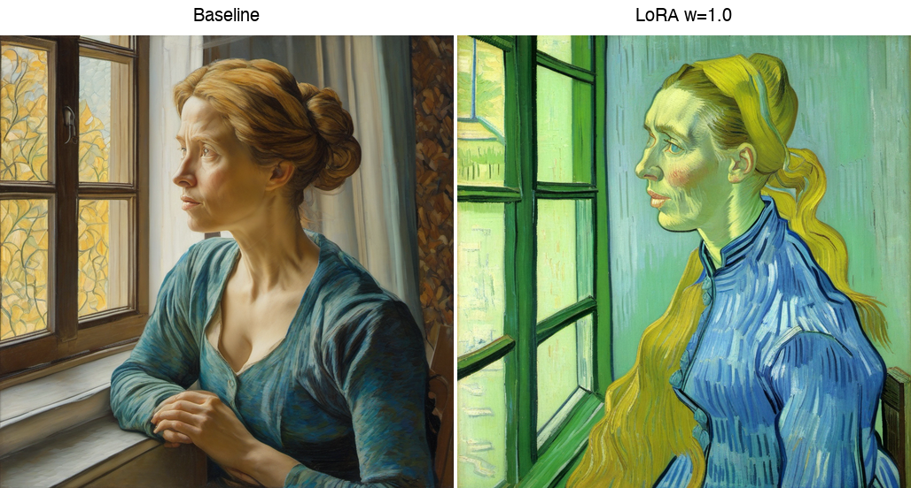
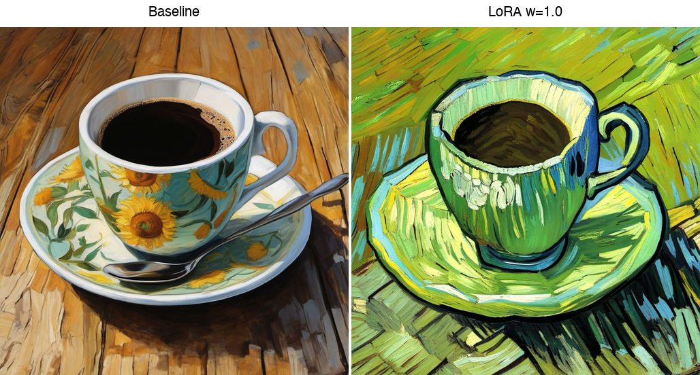
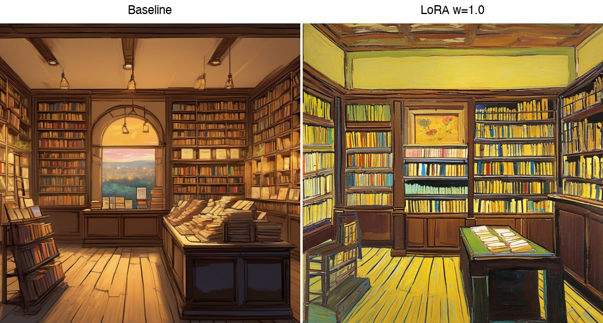
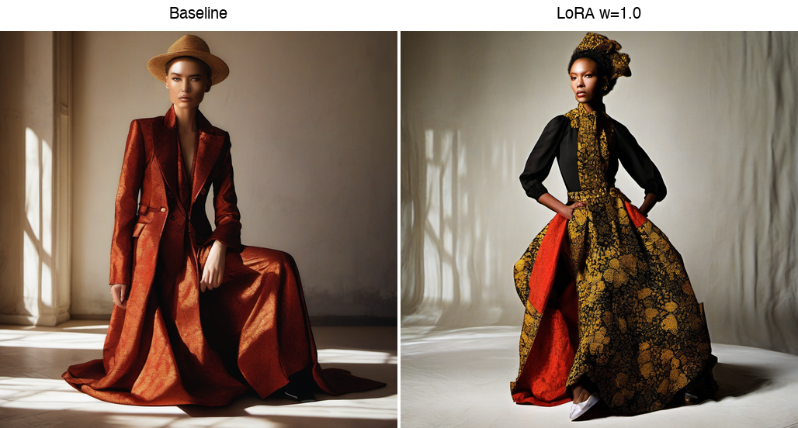
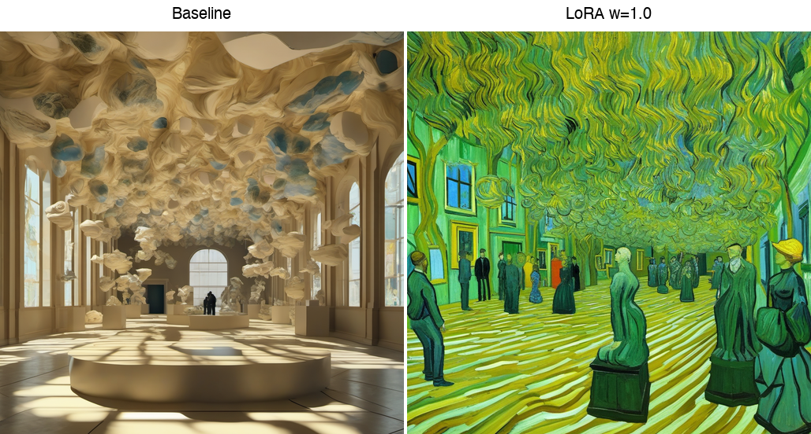
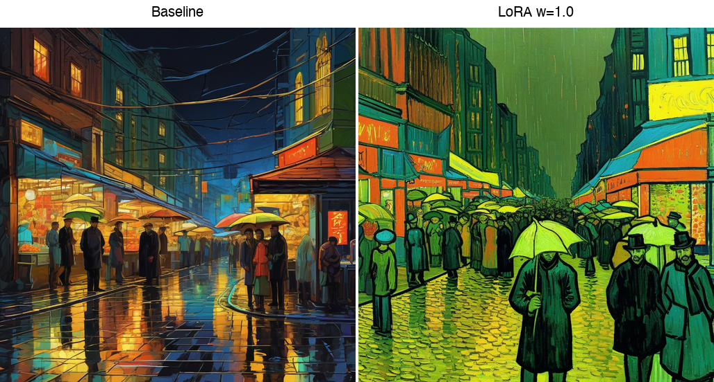
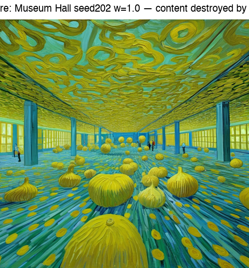
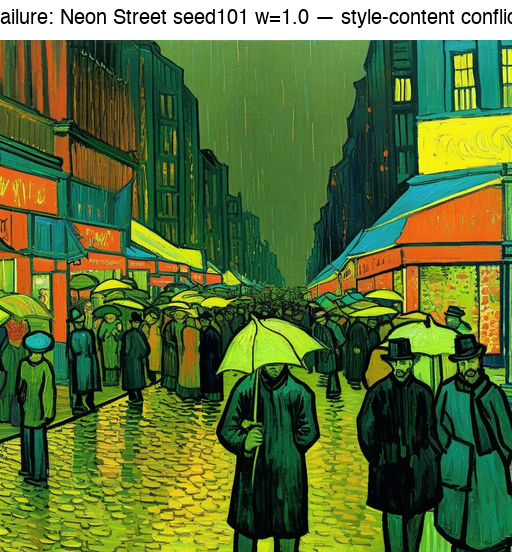
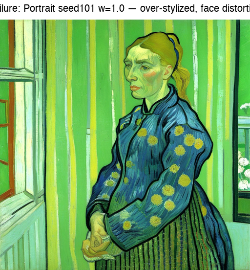

# Training a Van Gogh Style LoRA with SDXL: Texture Fidelity in Post-Impressionist Image Generation --- Scenario 3

**Course:** CA6114 Responsible AI Deployment, Nanyang Technological University  
**Date:** April 2026

---

## 1. Introduction and Scenario Selection

The rapid development of diffusion-based generative models has opened new possibilities for artistic image synthesis. Among these models, Stable Diffusion XL (SDXL) represents a state-of-the-art text-to-image architecture capable of producing high-resolution outputs with impressive compositional coherence. However, the base model is trained on a broad distribution of internet imagery and lacks the ability to reproduce specific artistic signatures on demand. This limitation motivates the use of parameter-efficient fine-tuning techniques such as Low-Rank Adaptation (LoRA), which inject a small number of trainable parameters into the frozen base model to steer its output toward a target distribution without catastrophic forgetting of its general capabilities.

LoRA achieves this by decomposing weight updates into low-rank matrices that are added to the original model weights during inference. Because only these small auxiliary matrices are trained --- typically representing less than 1% of the base model's total parameters --- the method is computationally efficient and produces compact adapter files that can be loaded, combined, or removed at inference time. This makes LoRA particularly well-suited for artistic style transfer, where the goal is to capture a specific visual vocabulary without retraining the entire diffusion model.

This report presents the results of an experiment conducted under **Scenario 3** of the assignment brief: training a custom LoRA adapter to transfer the post-impressionist painting style of Vincent van Gogh to SDXL-generated images. The specific period chosen is Van Gogh's **1888 Arles period**, during which he produced some of his most recognizable works, including *Cafe Terrace at Night*, *The Yellow House*, and numerous portraits and landscapes characterized by thick impasto brushstrokes, bold directional mark-making, and a vivid palette dominated by yellows, greens, and blues. This period was selected because it represents a concentrated, stylistically consistent phase in Van Gogh's career, providing a coherent training signal for the LoRA adapter.

The central research question is whether LoRA fine-tuning can reliably transfer Van Gogh's distinctive brushstroke texture and color sensibility to novel scenes described by text prompts, and how that transfer degrades as prompt complexity increases. The report evaluates style fidelity across three tiers of prompt complexity --- simple, medium, and complex --- using a systematic 72-image validation matrix. The core finding is that LoRA successfully captures impasto texture and warm color shifts for simple and moderately complex scenes, but style fidelity degrades significantly when prompts contain competing photographic semantics such as volumetric lighting, lens specifications, or reflective surfaces.

---

## 2. Dataset and Training Setup

### 2.1 Dataset Curation

The training dataset was assembled from public-domain images hosted on WikiArt, focusing exclusively on paintings by Vincent van Gogh dated to 1888 --- his prolific Arles period. An initial pool of **40 candidate images** was collected, from which **30 were curated** for the final training set. The curation criteria were as follows:

1. **Temporal consistency:** All selected works were painted during 1888 to ensure stylistic coherence. Van Gogh's style evolved rapidly across his career; mixing earlier Dutch-period works (dark palette, restrained brushwork) with the Arles period would introduce contradictory style signals.
2. **Resolution threshold:** All images were required to have a shortest side of at least **1024 pixels**, matching SDXL's native resolution. Images below this threshold were excluded to avoid upscaling artifacts that could corrupt the style signal during training.
3. **Subject diversity:** Within the temporal constraint, the curated set spans portraits (*A Mousme*, *Farmer With Straw Hat*), landscapes (*Harvest at La Crau*, *Farmhouse in Provence*), still lifes (*A Pair of Leather Clogs*, *Green Ears of Wheat*), interiors (*A Pork Butcher's Shop Seen from a Window*), and urban scenes (*Cafe Terrace Place du Forum Arles*). This diversity is important because the LoRA should learn brushstroke texture and color palette rather than memorizing specific compositions.

The 10 images excluded from the curated set (indices 31--40 in the source catalog) were marked as `raw_only` and reserved for potential future use. They were excluded due to lower resolution, atypical subject matter (e.g., copies after other artists), or compositional redundancy with already-selected works.

### 2.2 Captioning Strategy

Each training image was captioned using a **uniform template** that combines a trigger token with a painting-specific title and fixed style descriptors. Three representative captions illustrate the pattern:

> `<vangogh_style>, A Mousme, post-impressionist oil painting, expressive brushstrokes, vivid color palette, museum-quality artwork`

> `<vangogh_style>, Cafe Terrace Place Du Forum Arles, post-impressionist oil painting, expressive brushstrokes, vivid color palette, museum-quality artwork`

> `<vangogh_style>, Harvest At La Crau With Montmajour In The Background, post-impressionist oil painting, expressive brushstrokes, vivid color palette, museum-quality artwork`

The trigger token `<vangogh_style>` serves as the activation mechanism at inference time: including it in a prompt signals the model to engage the LoRA adapter's learned style weights. The fixed suffix --- "post-impressionist oil painting, expressive brushstrokes, vivid color palette, museum-quality artwork" --- was applied identically to all 30 images.

This uniform captioning design has a significant implication that will be revisited in Section 5 as a limitation. Because the style descriptors are identical across all images, the model may associate the trigger token with the generic textual concept of "expressive brushstrokes" rather than learning the specific visual structures present in the training data --- for instance, the directional hatching in Van Gogh's skies versus the short, stippled strokes in his foliage, or the thick impasto ridges on sunlit surfaces versus the smoother handling of shadow areas. A per-image caption strategy describing scene-specific visual attributes could potentially yield more nuanced style transfer.

### 2.3 Training Configuration

Training was conducted using sd-scripts with the DreamBooth method on a single NVIDIA A800 GPU. After training, the LoRA adapter was loaded into **ComfyUI**, a node-based visual workflow tool for diffusion model inference. The inference workflow was constructed from eight connected nodes: **CheckpointLoaderSimple** (loads the SDXL 1.0 base model) → **LoraLoader** (injects the trained Van Gogh LoRA with adjustable `strength_model` and `strength_clip` parameters) → two **CLIPTextEncode** nodes (positive and negative prompts) → **EmptyLatentImage** (1024×1024 latent canvas) → **KSampler** (the denoising engine) → **VAEDecode** (converts latent to pixel space) → **SaveImage** (writes the final PNG). After experimenting with different configurations in ComfyUI's visual interface, the final inference parameters were set to: **Euler sampler**, **30 denoising steps**, and **CFG scale 7** with the "normal" scheduler. These settings were found to produce a good balance between image quality and generation speed for SDXL at 1024×1024 resolution.

The complete training hyperparameters are summarized in the table below:

| Parameter | Value |
|---|---|
| Base Model | Stable Diffusion XL 1.0 |
| Trigger Token | `<vangogh_style>` |
| LoRA Rank / Alpha | 16 / 16 |
| UNet Learning Rate | 1e-4 |
| Text Encoder LR | 5e-5 |
| LR Scheduler | Cosine with 5% warmup |
| Dataset | 30 images x 10 repeats = 300 samples/epoch |
| Total Steps | 1200 (= 4 epochs) |
| Batch Size | 1 |
| Precision | bf16 |
| Hardware | NVIDIA A800 GPU |
| Training Time | 20 minutes 54 seconds |
| Final Average Loss | 0.167 |

Several design decisions merit brief explanation. The **LoRA rank of 16** represents a moderate capacity choice: ranks below 8 risk under-fitting the style signal, while ranks above 32 can lead to overfitting on a 30-image dataset. Setting **alpha equal to rank** (both 16) means the effective scaling factor is 1.0, which simplifies the relationship between the trained weights and the LoRA weight parameter used at inference time. The **dual learning rate** scheme --- a higher rate for the UNet (1e-4) and a lower rate for the text encoder (5e-5) --- reflects the standard practice of allowing the visual pathway to adapt more aggressively while keeping the text encoder's modifications conservative to preserve prompt-following ability. The **cosine scheduler with 5% warmup** ramps the learning rate gently during the first 60 steps before following a cosine decay curve, which helps stabilize early training when gradient magnitudes can be noisy on small datasets.

The dataset repeats (10 per image) yield 300 effective samples per epoch, and 4 epochs produce the total of 1200 training steps. This is a deliberately conservative training budget. Longer training could improve style saturation but risks overfitting, which in this context would manifest as generated images that reproduce specific training compositions rather than transferring generalizable style attributes to novel prompts. The final average loss of **0.167** suggests adequate convergence without signs of memorization (which would drive loss toward near-zero values).

---

## 3. Evaluation Design

### 3.1 Validation Matrix

To systematically evaluate the trained LoRA adapter, a **72-image validation matrix** was constructed by crossing three experimental dimensions:

- **6 prompts** spanning three complexity tiers (2 prompts per tier)
- **3 random seeds** (101, 202, 303) to sample generation variance
- **4 LoRA weight settings**: baseline (no LoRA, weight = 0), 0.6, 0.8, and 1.0

This 6 x 3 x 4 = 72 image grid provides a comprehensive view of how the LoRA adapter interacts with prompt content across varying levels of style intensity. The baseline condition (no LoRA) serves as the control, showing what the unmodified SDXL base model produces for each prompt. All images were generated at SDXL's native 1024×1024 resolution using the Euler sampler with 30 denoising steps and a classifier-free guidance (CFG) scale of 7, as configured in the ComfyUI workflow described in Section 2.3. The negative prompt `"low quality, blurry, distorted hands, extra fingers, text, watermark"` was applied uniformly across all generations.

### 3.2 Prompt Complexity Tiers

The six evaluation prompts were organized into three tiers based on the degree of photographic or compositional specificity they contain:

**Simple tier** --- prompts that describe a straightforward subject with minimal compositional direction:

- `"a portrait of a woman near a window, soft natural light"`
- `"a coffee cup on a wooden table, clean composition"`

**Medium tier** --- prompts that introduce photographic vocabulary or cinematic framing cues:

- `"a fashion editorial portrait, dramatic rim light, 85mm lens, rich color contrast"`
- `"a bookstore interior, warm ambient lighting, cinematic framing"`

**Complex tier** --- prompts that demand multi-element scene construction with layered spatial relationships and explicit lighting effects:

- `"a rainy neon street market at night, layered depth, reflective surfaces, crowded scene"`
- `"a surreal museum hall with floating sculptures, volumetric light, wide establishing shot"`

This tiering is motivated by the hypothesis that LoRA-based style transfer is most effective when the prompt's semantic demands are compatible with the style's visual vocabulary. Van Gogh's Arles-period paintings depict relatively simple compositions --- a single figure, a landscape, an interior --- rendered with bold, visible brushwork. Prompts that ask for photographic effects (rim lighting, lens blur), complex spatial arrangements (crowded scenes, floating objects), or reflective materials (wet surfaces, glass) may create a semantic tension that forces the model to arbitrate between the LoRA's stylistic influence and the prompt's content demands.

### 3.3 Scope of Detailed Analysis

While the full 72-image matrix is available for review, this report focuses its detailed analysis on **three representative prompts** --- one from each complexity tier: the portrait (simple), the bookstore interior (medium), and the surreal museum hall (complex). These three prompts were selected because they most clearly demonstrate the progressive degradation of style fidelity as prompt complexity increases. Results for the remaining three prompts (coffee cup, fashion editorial, neon street market) are presented in the appendix figures for reference.

### 3.4 Reproducibility and Evidence Trail (Automation)

To ensure the 72-image evaluation matrix is reproducible, all prompts/seeds/weights are generated and executed through an automated pipeline:

1. **Prompt template (source of truth):** `infra/templates/validation_prompts.yaml` defines the 3 tiers, 6 prompts, 3 seeds, 4 LoRA weight settings, and a global negative prompt.
2. **Manifest rendering:** `infra/bin/render_validation_manifest.py` expands the YAML into `runtime/workspace/report_assets/validation_manifest.csv` (one row per tier × prompt × seed × weight).
3. **Batch execution via ComfyUI API:** `infra/bin/run_comfyui_batch.py` loads a fixed workflow template (`infra/workflows/sdxl_style_lora_inference.json`), injects each CSV row into the workflow nodes, queues the job on ComfyUI, and writes `runtime/workspace/report_assets/validation_execution.csv` with prompt IDs and output file paths.

**Output naming rule.** Each generated image is saved with a deterministic prefix of the form:

`validation/{workspace_name}/{tier}/r{row_index}_{weight_tag}_seed{seed}_{prompt_tag}`

where `weight_tag` is either `baseline` or `w0p6/w0p8/w1p0`, and `prompt_tag` is a sanitized, lowercased prompt substring (non-alphanumeric → `_`, truncated). This naming rule enables appendix figures to reference exact files without manual bookkeeping.

### 3.5 Supplementary Ablation: Asymmetric LoRA Weights (UNet vs. Text Encoder)

ComfyUI exposes two independent LoRA sliders: `strength_model` (UNet pathway) and `strength_clip` (text-encoder pathway). The main 72-image matrix uses **symmetric weights** (same value for both) to keep the grid small and directly comparable across prompts.

To strengthen causal interpretation, a focused **asymmetric-weight ablation** can be run on a fixed prompt/seed (e.g., the medium bookstore prompt, seed 202), comparing:

- **(1.0, 1.0)**: fully symmetric maximum style
- **(1.0, 0.2)**: strong visual style injection with reduced semantic drift
- **(0.8, 0.0)**: UNet-only style, testing whether brushstroke/palette can be applied while minimizing text-side bias

The hypothesis is that lowering `strength_clip` reduces *semantic competition* (e.g., photography-domain anchors) and preserves content structure, while `strength_model` largely controls texture/palette transfer. This ablation is intentionally small (single prompt × single seed) because expanding it across all 72 settings would multiply the evaluation grid.

---

## 4. Findings --- Style Fidelity vs. Prompt Complexity

### 4.1 Summary Evaluation

The following table summarizes the key findings across the three focal prompts. Each row reports the subjective assessment at the LoRA weight that produced the strongest stylistic effect (w=1.0), along with the primary visual observation.

| Prompt | Tier | Best Weight | Style Fidelity | Aesthetic Quality | Realism | Main Observation |
|---|---|---|---|---|---|---|
| Portrait near window | Simple | 1.0 | High | High | Low | Brushstrokes clearly visible on skin/background; warm color shift; face becomes stylized |
| Bookstore interior | Medium | 1.0 | Medium-High | High | Medium | Warm palette naturally complements VG style; spatial structure preserved; brushstrokes on shelves |
| Museum hall | Complex | 1.0 | Medium | Medium | Low | Style competes with content; swirling ceiling textures (Starry Night feel); figures still recognizable |

The ratings above reflect qualitative judgments based on visual inspection across all three seeds. "Style Fidelity" measures how closely the output resembles authentic Van Gogh paintings in terms of brushwork, palette, and compositional treatment. "Aesthetic Quality" captures overall visual appeal regardless of stylistic accuracy. "Realism" indicates how photographic the result appears --- a low score here is expected and desirable when the goal is painterly stylization.

### 4.2 Simple Tier: Portrait Near a Window (Seed 202)

The simple portrait prompt produces the most dramatic and coherent style transfer in the entire validation set (see Appendix Fig. A1). The baseline image (no LoRA) renders a photorealistic woman in a blue-green garment, gazing out through a window with detailed curtain fabric, realistic skin tones, and autumn foliage visible through the glass. The lighting is naturalistic, with soft window light producing subtle gradations across the face and clothing.

At LoRA weight 1.0, the transformation is striking and immediately recognizable as Van Gogh-inflected. The background wall shifts to a flat, saturated green rendered in bold directional strokes --- a treatment directly reminiscent of the backgrounds in Van Gogh's Arles portraits such as *La Berceuse* or *Portrait of the Postman Joseph Roulin*. The subject's face takes on warm yellow-green tones with visible brushstroke texture across the cheeks and forehead. The hair transforms from a detailed photorealistic updo to a simplified mass of golden-yellow paint. The clothing, originally rendered with realistic fabric folds, becomes a field of blue directional strokes with clear impasto-like mark-making. Perhaps most notably, the window frame shifts from a realistic brown wooden frame to bold dark green outlines, and the view through the window simplifies from detailed foliage to broad strokes of green and yellow.

The success of this prompt can be attributed to its alignment with Van Gogh's own subject matter. The Arles training set contains multiple portraits of single figures (*A Mousme*, *Farmer With Straw Hat*), and the prompt's vocabulary --- "portrait," "woman," "window," "natural light" --- does not introduce photographic concepts that conflict with the painterly style. The simple composition (one figure, one window, one background) gives the LoRA adapter room to express its learned style without competing spatial demands.

Examining the progression across weights, the effect is already visible at w=0.6 (a subtle warming of the palette and softening of photographic detail) and becomes strongly painterly at w=0.8. The jump from w=0.8 to w=1.0 intensifies the color shift and brushstroke visibility but does not introduce compositional distortion. This suggests that for simple prompts, the LoRA adapter can be used at full strength without adverse effects.

It is worth noting, however, that seed 101 for the same prompt produces a less successful result (see Appendix Fig. A9). At w=1.0, the face becomes excessively stylized with a flattened, mask-like quality and a dominant yellow-green cast that overwhelms the facial features. The subject wears a patterned garment rendered as bold polka dots in thick paint. While still recognizable as a portrait, the over-stylization reduces the image's utility for applications requiring any degree of facial fidelity. This seed-dependent variability highlights the stochastic nature of the generation process --- the LoRA's style influence interacts with the noise initialization determined by the seed, and certain seeds can amplify specific aspects of the style (in this case, the flattening of facial features) beyond the desired range.

### 4.3 Medium Tier: Bookstore Interior (Seed 202)

The bookstore interior prompt occupies a productive middle ground where the prompt's inherent warmth naturally harmonizes with Van Gogh's characteristic palette (see Appendix Fig. A3). The baseline image depicts a traditional bookstore with dark wooden shelves lining the walls from floor to ceiling, a large arched window providing soft backlighting, a wooden floor with visible grain, and scattered books on a central table. The overall tone is already warm and atmospheric, with amber lighting suggesting late-afternoon sun.

At w=1.0, the LoRA adapter amplifies these warm qualities while transforming the rendering style. The bookshelves, originally detailed with individually visible book spines, gain a painterly texture where individual volumes blur into bands of color separated by directional horizontal strokes. The wooden floor undergoes a particularly effective transformation: the grain pattern becomes a field of parallel yellow-green strokes reminiscent of Van Gogh's treatment of agricultural fields and wooden surfaces in works like *The Bedroom in Arles*. The large arched window, originally filled with a soft landscape view, simplifies into a bright yellow-green luminous form that serves as a focal point. The ceiling and upper walls shift to a saturated yellow that recalls the warm interior tones of *The Night Cafe*.

What makes this prompt especially interesting is that the spatial structure is **well-preserved** despite the significant style transformation. The room's perspective --- the receding bookshelves, the central table, the floor converging toward the back wall --- remains intact and legible. This is notable because Van Gogh's own paintings often maintained clear spatial organization even while deploying highly expressive brushwork. The LoRA adapter appears to have learned this structural discipline alongside the surface texture, producing results where the style transforms the rendering of surfaces without collapsing the underlying geometry.

The medium-tier results also reveal an interesting interaction between prompt semantics and style expression. The bookstore prompt includes "warm ambient lighting" and "cinematic framing" --- terms that describe mood and composition rather than specific photographic techniques. These descriptors are semantically compatible with Van Gogh's warm-palette, carefully composed interiors. Prompts that instead employ explicitly photographic terms (e.g., references to specific lens focal lengths or studio lighting setups) tend to produce less coherent style transfer, as the photographic vocabulary anchors the generation in a realist rendering mode that resists painterly transformation. This observation reinforces the thesis that **prompt vocabulary plays a critical role in determining style transfer quality**, independent of compositional complexity.

### 4.4 Complex Tier: Surreal Museum Hall (Seed 101)

The complex museum hall prompt produces the most visually dramatic results in the validation set, but also reveals the limits of LoRA-based style transfer when prompt demands become highly specific (see Appendix Fig. A5). The baseline image depicts a grand museum space with high vaulted ceilings, from which organic, cloud-like sculptural forms appear to float. Volumetric light streams through tall arched windows, casting long shadows across a polished floor. A single small figure stands in the middle distance, providing scale. The overall aesthetic is one of monumental, surreal architecture rendered with photographic precision.

At w=1.0, the transformation is radical. The ceiling's floating sculptures dissolve into swirling, turbulent forms rendered in green and yellow --- an unmistakable echo of *The Starry Night's* sky treatment. The walls transform into patchworks of green, yellow, and blue rectangles that suggest both architectural elements and a flattened painterly interpretation of the space. The floor becomes a field of bold yellow-green stripes that simultaneously read as shadows (from the original volumetric light) and as Van Gogh's characteristic directional brushwork applied to a horizontal surface. Crucially, human figures remain present and recognizable as dark silhouettes distributed throughout the space, though they are now rendered as simplified painted forms rather than photographic figures.

This result demonstrates both the power and the limitation of the LoRA approach. The style successfully imposes Van Gogh's visual signature onto the entire image --- the color palette, the visible brushwork, the energetic mark-making are all present and coherent. However, the original prompt's specific demands --- "floating sculptures," "volumetric light," "wide establishing shot" --- are substantially reinterpreted. The floating sculptures have become abstract painted forms rather than recognizable objects suspended in space. The volumetric light is no longer a photographic effect with visible light rays but is translated into contrast between yellow stripes and green shadows. The "wide establishing shot" framing is preserved in the sense that the space feels large and the figures are small, but the photographic depth-of-field cues that would normally accompany such a shot are absent.

The key finding here is one of **semantic competition**. When the prompt asks for effects that belong to the photographic domain (volumetric light, reflective surfaces, lens-specific rendering), the LoRA adapter must arbitrate between its learned painterly style and the prompt's photographic expectations. In most cases at w=1.0, the style wins this competition, but the result is a painting *about* the prompted scene rather than a photographic image *in* the prompted style. This distinction matters for practical applications: a user who wants "a museum scene that looks like a Van Gogh painting" will find the result satisfying, but a user who wants "a photographic museum scene with Van Gogh's color palette" will find the brushstroke texture and spatial flattening excessive.

The seed-dependent variability is particularly pronounced at the complex tier. While seed 101 produces a visually striking and compositionally coherent result, seed 202 for the same prompt yields a catastrophic failure (see Appendix Fig. A7, discussed in Section 5). This indicates that complex prompts operate in a regime where the LoRA's influence is less stable and more sensitive to the initial noise pattern.

### 4.5 Cross-Tier Patterns

Several patterns emerge from examining the full validation matrix across all six prompts and three seeds:

**Color shift consistency.** Across all prompts and weights, the LoRA adapter produces a consistent shift toward Van Gogh's Arles palette: warm yellows, vivid greens, deep blues, and reduced reds. This color signature is the most robust aspect of the style transfer, appearing even at the lowest weight (w=0.6) and persisting across all complexity tiers. It suggests that the LoRA has strongly encoded Van Gogh's characteristic color relationships, likely because these are consistent across all 30 training images.

**Brushstroke visibility scales with weight.** The visibility of individual brushstrokes follows a clear gradient across LoRA weights. At w=0.6, brushstrokes are subtly suggested --- surfaces appear slightly textured but could pass as a stylized rendering rather than an obvious painting. At w=0.8, brushstrokes become clearly visible and directional, establishing the image unambiguously as a painting. At w=1.0, brushstrokes dominate the surface treatment, with thick, impasto-like marks that define the character of every surface in the image. This progressive scaling gives users practical control over the degree of stylization.

**Spatial complexity tolerance.** Simple scenes (one subject, one background plane) maintain compositional integrity even at w=1.0. Medium scenes (interior spaces with multiple objects and depth planes) maintain their spatial structure but lose fine detail on individual objects. Complex scenes (multi-element compositions with specific lighting demands) undergo significant spatial reinterpretation, with some elements (floating sculptures, reflective surfaces) losing their identity as the style asserts dominance over content.

**Photographic vocabulary creates conflict.** The single strongest predictor of style degradation is the presence of explicitly photographic terms in the prompt. Prompts containing "rim light," "85mm lens," "volumetric light," or "reflective surfaces" consistently produce less coherent style transfer than prompts using painterly or neutral descriptors. This is consistent with the hypothesis that such terms activate photorealistic generation pathways in the base model that compete directly with the LoRA's painterly modifications.

---

## 5. Limitations and Future Improvements

### 5.1 Limitations of the Current Approach

**Limitation 0: Baseline is not a “no-token” control.** In the automated evaluation matrix, the **baseline condition uses LoRA weight = 0.0 but still includes the trigger token** in the text prompt (because the prompt template always begins with `<trigger_token>`). This means the baseline isolates the effect of *LoRA weights*, but not the effect of the *token’s textual semantics* inside SDXL’s text embedding space. A stricter control would add an additional condition that removes the trigger token entirely (true SDXL baseline), which is especially important when a token is semantically suggestive (e.g., it may bias content toward “painting” even without LoRA weights).

**Limitation 1: Uniform caption template.** As noted in Section 2.2, all 30 training images use an identical style descriptor suffix: "post-impressionist oil painting, expressive brushstrokes, vivid color palette, museum-quality artwork." While this approach ensures training simplicity and prevents caption noise, it conflates the visual style signal with a generic textual description of that style. The trigger token `<vangogh_style>` may learn to associate with the textual concept of "expressive brushstrokes" as a whole rather than encoding the specific visual structures present in different training images.

Consider the difference between Van Gogh's treatment of a sky (long, curving, parallel strokes that create rhythmic patterns) versus his treatment of foliage (short, stabbing, multi-directional dabs) versus his treatment of a face (carefully modeled with relatively smooth transitions despite visible brushwork). A per-image captioning strategy could describe these scene-specific attributes: "swirling directional sky strokes with thick paint ridges," or "short stippled brushwork in dense foliage with visible canvas texture." Such captions would allow the model to learn conditional relationships between subject matter and brushwork technique, potentially enabling it to apply sky-appropriate strokes to skies and face-appropriate strokes to faces, rather than applying a uniform "expressive brushstroke" treatment to all surfaces.

**Limitation 2: No systematic checkpoint comparison.** The training process saved intermediate checkpoints at steps 200, 400, 600, 800, and 1000, in addition to the final checkpoint at step 1200. However, only the final checkpoint was used for the 72-image validation matrix. It is possible --- even likely --- that intermediate checkpoints would produce different trade-offs between style fidelity and content preservation. An earlier checkpoint (e.g., step 600 or 800) might yield a softer style influence that better preserves complex scene structures, making it more suitable for the complex-tier prompts where the final checkpoint tends to overwhelm content. A systematic comparison across checkpoints, evaluated on the same prompt/seed/weight grid, would provide valuable guidance for selecting the optimal training duration for different use cases.

**Limitation 3: No local editing capability.** The current workflow generates complete images in a single pass, applying the LoRA's style uniformly across the entire canvas. This all-or-nothing approach is a significant practical limitation. In many real-world artistic applications, selective stylization is desirable --- for example, applying strong Van Gogh brushwork to a landscape background while keeping a foreground portrait subject more naturalistic, or varying the intensity of the style effect between different spatial regions. Inpainting workflows or regional prompt conditioning (as implemented in tools like ControlNet) would enable such fine-grained control, but integrating these capabilities was beyond the scope of this experiment.

**Limitation 4: ComfyUI lacks integrated LoRA training.** While ComfyUI provides an excellent node-based interface for designing and executing inference workflows, the LoRA training itself had to be performed with a separate command-line tool (sd-scripts). This split between training and inference environments creates friction: after each training run, the checkpoint must be manually transferred into ComfyUI's model directory before it can be tested. A more integrated tool would allow users to train, evaluate, and iterate on LoRA adapters within a single visual environment, significantly reducing the feedback loop between training adjustments and visual results. This gap is particularly notable because ComfyUI already supports loading and adjusting LoRA weights at inference time — extending that capability upstream to training would be a natural and valuable evolution of the tool.

### 5.2 Failure Case Analysis

The most instructive failures in the validation set occur when high LoRA weight (w=1.0) is combined with complex prompts and an unlucky seed.

**Museum hall, seed 202, w=1.0** (see Appendix Fig. A7). This image represents the most extreme failure mode observed. The museum's spatial structure is completely destroyed: the floor becomes a field of blue-yellow circular or ovoid forms that bear no relationship to the original prompt's "museum hall" composition. The ceiling and walls dissolve into swirling patterns of yellow and green. No human figures are discernible, and the "floating sculptures" have been replaced by amorphous colored masses. The image reads as an abstract painting with Van Gogh color characteristics but zero content fidelity. This failure demonstrates that at high weights with complex scenes, certain seed-noise combinations can push the LoRA adapter into a mode where style completely overwhelms content, producing outputs that satisfy the style objective while catastrophically failing the content objective.

**Portrait, seed 101, w=1.0** (see Appendix Fig. A9). Even at the simple tier, specific seeds can produce over-stylized results. In this case, the portrait subject's face is rendered with a flattened, mask-like quality and an exaggerated yellow-green cast. The subject wears a patterned garment rendered as bold polka dots in thick paint. While the image is unmistakably Van Gogh-influenced --- it bears a striking resemblance to Van Gogh's actual portrait paintings --- the level of stylization goes beyond what most users would consider a successful blend of content and style. The face has lost its naturalistic proportions and expressiveness, becoming a painted archetype rather than a depicted individual.

These failures share a common pattern: they occur when the LoRA adapter's style signal is strong enough to override the base model's content-generation pathways. The practical implication is that **LoRA weight should be treated as a content-dependent parameter**, not a fixed setting.

| Failure Type | Typical Trigger | Observable Symptom | Mitigation (Actionable) |
|---|---|---|---|
| Content collapse (complex prompts) | High weight + photography-domain constraints (e.g., volumetric light, reflective surfaces) | Scene geometry dissolves into abstract strokes; objects/figures disappear | Reduce `strength_model` (e.g., 1.0 → 0.6/0.8); rewrite prompt to remove camera/lighting jargon; prefer earlier checkpoint (e.g., step 600/800); add ControlNet depth/edges to anchor structure |
| Over-stylized faces | High weight on portrait prompts + unlucky seed | Facial proportions flatten; mask-like faces; identity lost | Lower `strength_model` while keeping `strength_clip` moderate; add negative prompts targeting face distortion; try multiple seeds and select the best seed for the same prompt |
| Style–content conflict (hybrid artifacts) | Modern scenes with strong domain priors (e.g., neon street) | Partial stylization: palette shifts but materials/lighting stay photographic | Replace photo terms with painterly descriptors (“brushwork”, “oil paint”, “flat background”); lower CFG or LoRA weight to reduce competition; consider a two-stage workflow (generate structure first, then stylize via img2img) |

Simple scenes can tolerate w=1.0; complex scenes often require w=0.6 or w=0.8 to maintain content fidelity.

### 5.3 Future Directions

Several directions could address the limitations identified above and extend the utility of the Van Gogh LoRA adapter:

**Multi-style LoRA blending.** SDXL supports loading multiple LoRA adapters simultaneously with independent weight parameters. Training additional LoRA adapters for other post-impressionist artists (e.g., Cezanne, Gauguin, Seurat) would enable blending experiments --- for instance, combining Van Gogh's brushwork intensity with Cezanne's spatial structure at different weights to produce novel hybrid styles. Such experiments would also illuminate how different LoRA adapters interact in the shared weight space.

**Texture granularity control.** The current LoRA adapter encodes both color palette and brushstroke texture as a single, inseparable style signal. Separating these dimensions --- for example, by training separate LoRA adapters for color palette and brushstroke texture, or by using techniques such as concept sliders --- would give users finer control over which aspects of Van Gogh's style to apply. A user could then request Van Gogh's colors without his brushstrokes, or his brushwork intensity without the warm palette shift.

**ControlNet integration for selective application.** Pairing the LoRA adapter with ControlNet-based spatial conditioning (depth maps, edge maps, semantic segmentation) would enable region-specific style intensity. A depth-conditioned approach could apply stronger style to background elements while preserving foreground detail, addressing the limitation noted in Section 5.1 about the all-or-nothing style application.

**Automated evaluation metrics.** The current evaluation relies on qualitative visual inspection, which is inherently subjective and does not scale. Future work could incorporate automated metrics such as CLIP-based style similarity (measuring embedding distance between generated images and the training set), Frechet Inception Distance (FID) against the training distribution, or specialized brushstroke detection algorithms that quantify stroke directionality, thickness, and density. Such metrics would enable systematic hyperparameter optimization and checkpoint selection.

---

## 6. Conclusion

This experiment demonstrates that LoRA fine-tuning is a viable and efficient method for transferring a specific artist's visual style to a general-purpose text-to-image model. With only 30 training images from Van Gogh's 1888 Arles period and approximately 21 minutes of training time on a single GPU, the resulting LoRA adapter successfully captures the essential characteristics of Van Gogh's post-impressionist technique: thick impasto brushstrokes with visible directionality, a warm palette dominated by yellows and greens, bold outlining of forms, and a distinctive flattening of spatial depth that transforms photographic scenes into painted interpretations.

The experiment reveals that the quality of style transfer is highly dependent on prompt design. Simple, descriptive prompts that align with Van Gogh's own subject matter --- portraits, interiors, still lifes, landscapes --- produce the strongest and most coherent results. The LoRA adapter excels at transforming these scenes into convincing painterly interpretations where every surface carries the signature of Van Gogh's brush. Medium-complexity prompts produce successful results when their vocabulary is compatible with the painterly aesthetic; the bookstore interior, with its warm tones and architectural structure, represents an optimal intersection of moderate complexity and stylistic harmony.

However, complex prompts that demand photographic effects (volumetric light, reflective surfaces, specific lens characteristics) create a semantic tension that degrades style fidelity. The model is forced to arbitrate between the LoRA's painterly modifications and the prompt's photographic expectations, producing results that can range from interestingly hybrid to completely content-destructive, depending on the seed. This finding has practical implications: the Van Gogh LoRA is best deployed as a tool for **painterly stylization** of moderate-complexity scenes rather than as a universal style filter applicable to any prompt.

Three areas emerge as the most impactful for future improvement. First, per-image captioning that describes scene-specific brushwork characteristics could yield a more nuanced and controllable style transfer. Second, systematic checkpoint comparison would enable selecting the optimal training duration for different prompt complexity regimes. Third, integration with spatial conditioning tools like ControlNet would unlock selective style application, enabling users to vary style intensity across different regions of an image.

The broader lesson from this experiment is that LoRA-based artistic style transfer is not merely a technical parameter-tuning exercise but a problem at the intersection of art history, computational aesthetics, and prompt engineering. Understanding *what* makes a style distinctive --- and how those distinctive features interact with the semantic structure of text prompts --- is as important as the model architecture and training configuration. Van Gogh's Arles period, with its consistent and immediately recognizable visual vocabulary, proves to be an excellent candidate for LoRA-based style capture, but realizing the full potential of that capture requires thoughtful alignment between prompt design and the style's inherent strengths.

---

## Appendix

### A. Generated Image Comparisons

All images below compare the SDXL baseline (no LoRA) against the LoRA-adapted output at weight 1.0. Each pair uses the seed indicated in the caption.

**Fig. A1:** Simple --- Portrait (seed 202): Baseline vs LoRA w=1.0



*The baseline renders a photorealistic woman by a window with autumn foliage. At w=1.0, the background transforms to flat green directional strokes, skin takes on yellow-green tones, and clothing becomes a field of blue impasto marks.*

---

**Fig. A2:** Simple --- Coffee Cup (seed 101): Baseline vs LoRA w=1.0



*The baseline depicts a decorative coffee cup with sunflower motifs on a wooden table. At w=1.0, the cup shifts to solid green, the saucer gains visible brushstrokes, and the wooden table surface becomes a field of bold green-yellow directional marks.*

---

**Fig. A3:** Medium --- Bookstore (seed 202): Baseline vs LoRA w=1.0



*The baseline shows a traditional bookstore with detailed shelving and an arched window. At w=1.0, the palette shifts to warm yellows and greens, the floor gains impasto-like strokes, and the window becomes a luminous yellow-green focal point. Spatial structure is well preserved.*

---

**Fig. A4:** Medium --- Fashion Editorial (seed 101): Baseline vs LoRA w=1.0



*The baseline is a high-fashion portrait with dramatic lighting and an orange garment. At w=1.0, the figure retains its pose but the garment transforms into painterly gold-brown tones with visible brushwork, and the background darkens with reduced photographic lighting effects.*

---

**Fig. A5:** Complex --- Museum Hall (seed 101): Baseline vs LoRA w=1.0



*The baseline depicts a surreal museum space with floating organic sculptures and volumetric light. At w=1.0, the ceiling becomes swirling green-yellow forms, the floor shifts to bold yellow-green stripes, and figures become dark painted silhouettes. Content is dramatically reinterpreted but remains legible.*

---

**Fig. A6:** Complex --- Neon Street (seed 101): Baseline vs LoRA w=1.0



*The baseline renders a rainy neon-lit night market with reflective wet pavement. At w=1.0, the palette shifts from cool blues and warm neons to green-gold tones, figures become flat green silhouettes with umbrellas, and the reflective pavement becomes yellow cobblestone-like brushwork.*

---

### B. Failure Cases

**Fig. A7:** Failure --- Museum Hall (seed 202, w=1.0): Content destroyed by style



*Complete content collapse. The museum's spatial structure is replaced by blue-yellow circular forms on the floor and swirling yellow-green patterns throughout. No figures or architectural elements are discernible. The image reads as an abstract painting with Van Gogh's palette.*

---

**Fig. A8:** Failure --- Neon Street (seed 101, w=1.0): Style-content conflict



*The street structure is preserved but the warm green-gold palette conflicts with the nighttime neon atmosphere. Figures become flat green forms, losing individuality. The rain and reflective surfaces are replaced by opaque painted marks, creating cognitive dissonance between the scene's expected mood and its rendered appearance.*

---

**Fig. A9:** Failure --- Portrait (seed 101, w=1.0): Over-stylized face distortion



*The subject's face is flattened into a mask-like form with exaggerated yellow-green tones. The patterned garment is rendered as bold polka dots in thick paint. While recognizably Van Gogh-influenced, the stylization exceeds the useful range for applications requiring facial fidelity.*

---

### C. Training Configuration Reference

| Parameter | Value |
|---|---|
| Base Model | Stable Diffusion XL 1.0 |
| Trigger Token | `<vangogh_style>` |
| LoRA Rank / Alpha | 16 / 16 |
| UNet Learning Rate | 1e-4 |
| Text Encoder LR | 5e-5 |
| LR Scheduler | Cosine with 5% warmup |
| Dataset | 30 images x 10 repeats = 300 samples/epoch |
| Total Steps | 1200 (= 4 epochs) |
| Batch Size | 1 |
| Precision | bf16 |
| Hardware | NVIDIA A800 GPU |
| Training Time | 20 minutes 54 seconds |
| Final Average Loss | 0.167 |

### D. Training Log Excerpt

```
Training completed 1200/1200 steps in 20 minutes 54 seconds. Final average loss: 0.167.
```

### E. Validation Prompt Reference

All prompts used the trigger token `<vangogh_style>` prepended to the scene description. The negative prompt `"low quality, blurry, distorted hands, extra fingers, text, watermark"` was applied to all generations.

| Tier | Prompt |
|---|---|
| Simple | `"a portrait of a woman near a window, soft natural light"` |
| Simple | `"a coffee cup on a wooden table, clean composition"` |
| Medium | `"a fashion editorial portrait, dramatic rim light, 85mm lens, rich color contrast"` |
| Medium | `"a bookstore interior, warm ambient lighting, cinematic framing"` |
| Complex | `"a rainy neon street market at night, layered depth, reflective surfaces, crowded scene"` |
| Complex | `"a surreal museum hall with floating sculptures, volumetric light, wide establishing shot"` |
